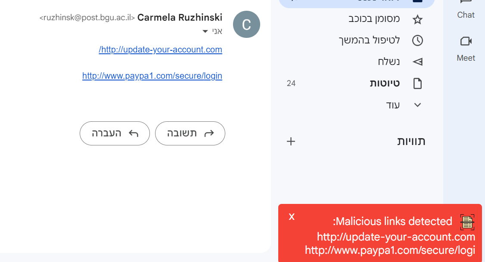
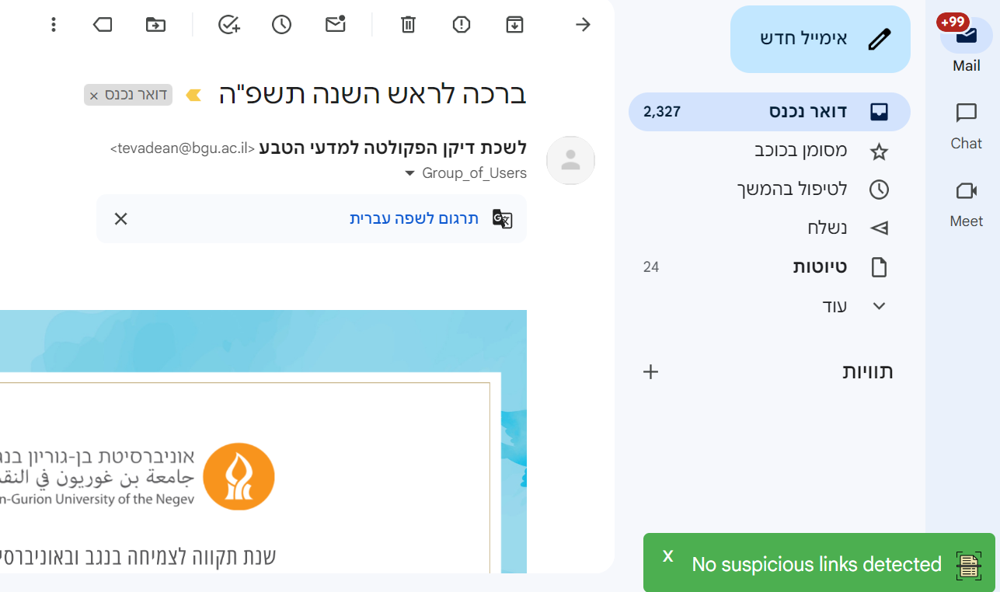
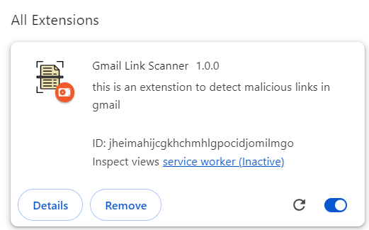

# Gmail Link Scanner - Chrome Extension
### About
Welcome to the Gmail Link Scanner! This Chrome extension scans links in Gmail for potential phishing or malicious content. The extension analyzes the URLs within email messages to detect suspicious links. The tool alerts users when malicious URLs are detected, helping them avoid phishing attacks or unsafe websites.

### Technologies Used
- JavaScript
- Chrome Extensions API
- VirusTotal API

### Features
- Scans links in Gmail for suspicious patterns like IP addresses, suspicious TLDs, and phishing keywords.
- Sends suspicious URLs to VirusTotal for further analysis.
- Alerts users with notifications if malicious URLs are detected.

### How It Works
1. **Link Scanning:** The extension detects links in Gmail messages and checks them against known phishing patterns (e.g., suspicious keywords or TLDs).
2. **VirusTotal API Check:** Links flagged as suspicious are sent to VirusTotal via an API request to verify if they are malicious.
3. **Alerts**: If VirusTotal detects malicious content, a notification alerts the user.

## Usage Instructions

### 1. Install the Extension
To install the Gmail Link Scanner extension:

1. Clone or download the extension from this repository.
2. Open Chrome and go to `chrome://extensions/`.
3. Enable **Developer mode** in the top-right corner.
4. Click on **Load unpacked** and select the folder containing the extension files.
5. You should now see the Gmail Link Scanner extension icon in your browser.

### 2. How to Use

Once installed, the Gmail Link Scanner automatically scans all the links in your Gmail messages for malicious content.

#### Example of malicious Link notification:
If a malicious link is detected, you'll see a red notification like the following:

#### Example of Safe Link Example notification:
For safe links, a green notification will appear:

### 3. Managing the Extension

To disable or remove the extension:

1. Go to `chrome://extensions/`.
2. Find the Gmail Link Scanner extension.
3. You can either disable or remove it using the toggle or remove button.

**Enjoy!**
